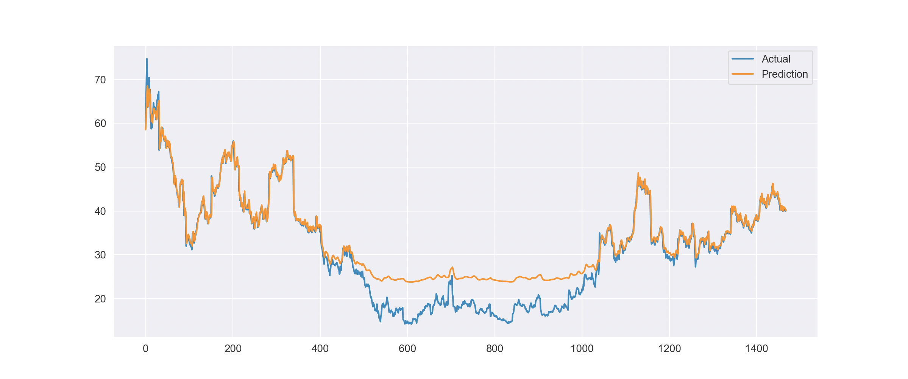

# Apollo

Predicts stock prices using a neural network, built using Keras (and matplotlib for graphing).

## Twitter Stock (Example)

The graph below shows the stock predictions (high values) for Twitter (TWTR). The model was trained with daily values over 6 years, so the x axis represents the full time frame, and the y axis is the stock price.

## About

There are two main parts to this. The data, and the model/training process (probably more but for now at least).

### Data
The stock data is straight from [Yahoo Finance](https://finance.yahoo.com/), which provides historical stock data, downloadable as a `.csv` file. 

For now I chose to use [Twitter](https://finance.yahoo.com/quote/TWTR?p=TWTR&.tsrc=fin-srch). The data is daily stock prices spanning 6 years. Each day has the following pieces of data:

- Date
- Open
- High
- Low
- Close
- Adj Close
- Volume

### Model/Training
[Keras](https://keras.io/) makes it super easy to prototype models quickly, so I used it to build an LSTM model. For training, high values for 30 days (window size) are fed into the model, and it predicts the 31st day. The values are pulled right from the downloaded csv, meaning the "daily values" are outdated basically every day. _Note that the values are also normalized to allow for better/faster training._

Since there's only 1 feature (high value) it's not always accurate in its predictions. Currently doing some research and working on incorporating more features in the training process (potentially using trade volume, etc.)

## Usage

Before you try it for yourself, make sure you have the necessary packages installed:

` pip3 install -r requirements.txt `

Using it is pretty easy, just run `python3 main.py` with one or more of the following arguments:

- `train` will create, train, and save the model for later use
- `graph` will graph predictions vs actual values (like shown above)
- `tomorrow` will use the latest 30 days to predict the next day's high stock value

You can chain these commands, essentially running them in order for ease of use.

Example:

`python3 main.py train graph` will create, train, and save the model, then immediately graph the predicted values.
